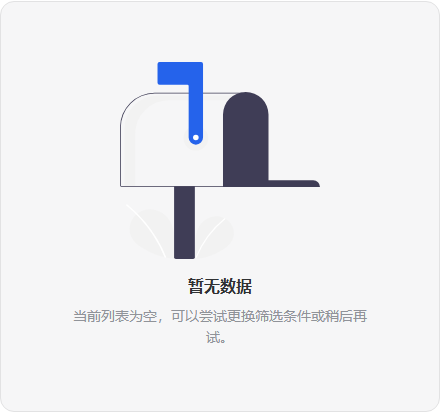
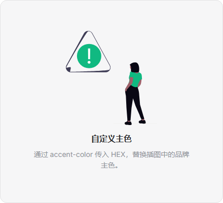
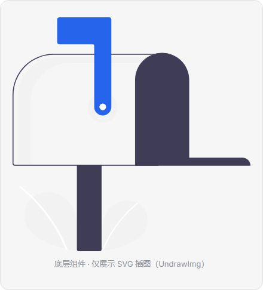

# DrawE · draw-empty

基于 **Vue 3** 的 **插画空状态** 组件：**`<DrawEmpty>`** 上图下文一体编排；底层 **`<UndrawImg>`** 按需加载本地 **unDraw** 风格 SVG，并支持 **`accentColor`** 换色与 **`createDrawEmptyPlugin`** 全局注册。

[](https://vuejs.org/)
[](https://vitepress.dev/)
[](https://www.typescriptlang.org/)
[](https://nodejs.org/)
[](https://opensource.org/licenses/MIT)
[](./docs/guide/changelog.md)

| [在线文档（GitHub Pages）](https://yujunok.github.io/draw-empty/) | [更新日志](./docs/guide/changelog.md) | [Releases](https://github.com/yuJunOk/draw-empty/releases) | [npm 依赖接入](./docs/guide/npm.md) | [组件 API / Demo](./docs/components/draw-empty.md) |
| :--: | :--: | :--: | :--: | :--: |

---

## 特性

- 专为 **留白 / 空列表 / 无数据** 场景设计的 **`<DrawEmpty>`**，支持标题、描述、默认插槽、`#extra`、`#image`
- **`<UndrawImg>`** 单独使用亦可；插图来自仓库内 **`src/assets/undraw-illustrations/*.svg`**
- **`accentColor` / `accent-color`**：HEX 替换 SVG 中的常见演示色；可通过 **`createDrawEmptyPlugin({ accentColor })`** 全局注入
- 附带 **VitePress** 文档站：指南、npm 说明、可运行 Demo、插图浏览页
- 当前 npm 包以 **`src/` 源码**分发（`.vue` + 资源），业务侧需 **Vite / vue-loader** 等可编译 SFC 的工具链

---

## 安装

本仓库通过 **GitHub Release**、**Git 依赖** 或 **本地 `.tgz` / 路径** 分发即可；**`package.json` 中的 `private: true`** 表示**不以 npm 公共 registry 为主要安装来源**。安装命令与本地验证方式见 [**docs/guide/npm.md**](./docs/guide/npm.md)。

**从 Release 安装 `.tgz`（示例版本 `v0.1.0`，请按实际 Release 替换）：**

```bash
npm install https://github.com/yuJunOk/draw-empty/releases/download/v0.1.0/draw-empty-0.1.0.tgz
```

其他方式（Git、`file:`、本地打包路径）同上文档。

---

## 用法示例

在业务项目 **`main.ts`** 中注册插件（可选全局主色）：

```ts
import { createApp } from 'vue'
import App from './App.vue'
import { createDrawEmptyPlugin } from 'draw-empty'

const app = createApp(App)

app.use(
  createDrawEmptyPlugin({
    accentColor: '#2563EB',
  }),
)

app.mount('#app')
```

在任意 **`.vue`** 模板中：

```vue
<template>
  <DrawEmpty
    title="暂无数据"
    description="请稍后再试或更换筛选条件"
    illustration="Empty"
  />
</template>
```

更多 props、插槽与 **`UndrawImg`** 说明见 [**组件文档**](./docs/components/draw-empty.md)。

---

## 预览

| 基础 | 操作区 + extra | accent | UndrawImg |
|------|----------------|--------|-----------|
|  |  |  |  |

---

## 克隆与本地文档站

需要 **Node.js 18+**；首次拉取演示插图需可访问 **https://undraw.co/**。

```bash
git clone https://github.com/yuJunOk/draw-empty.git
cd draw-empty
npm install
npm run prepare:undraw   # 若插图已随仓库提交可跳过
npm run dev              # 默认本地文档站，终端会打印 URL
```

静态构建与预览：

```bash
npm run build    # 产物 docs/.vitepress/dist/
npm run preview
```

**GitHub Pages**：仓库 **Settings → Pages → Source** 选择 **GitHub Actions**，推送 **`main` / `master`** 后由工作流发布；子路径 **`VITEPRESS_BASE`** 与故障排查见 [**DEVELOPMENT.md §5**](./DEVELOPMENT.md)。

---

## 常用脚本

| 命令 | 说明 |
|------|------|
| `npm run dev` | VitePress 开发服务器 |
| `npm run build` / `npm run preview` | 构建 / 预览静态文档站 |
| `npm run prepare:undraw` | 演示用 SVG → `src/assets/undraw-illustrations/` |
| `npm run prepare:undraw:all` | 尽量拉全库（体积大、耗时长） |
| `npm run typecheck` | `src/` 组件类型检查 |
| `npm run pack` | 生成 `releases/draw-empty-*.tgz`（需先创建 `releases/` 目录） |

插图脚本与改文档站心得 → [**DEV_HELPER.md**](./DEV_HELPER.md)；架构与扩展流程 → [**DEVELOPMENT.md**](./DEVELOPMENT.md)。

---

## 许可

- 仓库代码：**[MIT](./LICENSE)**
- 插图著作权遵循 [unDraw 许可](https://undraw.co/license)
